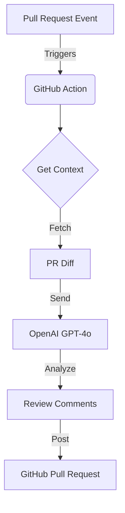

# AI PR Reviewer Agent

An automated GitHub Action that reviews Pull Requests using OpenAI's GPT models. It analyzes code changes for bugs, security vulnerabilities, and style issues, posting comments directly on the PR.

## Features

- **Automated Code Review**: Analyzes git diffs using OpenAI.
- **Security Detection**: Highlights potential security flaws.
- **Line-by-Line Comments**: Posts specific feedback on the relevant lines of code.
- **Configurable**: Support for different OpenAI models and severity filters.

## Usage

Add this action to your workflow file (e.g., `.github/workflows/review.yml`):

```yaml
name: AI PR Reviewer
on: [pull_request]

jobs:
  review:
    runs-on: ubuntu-latest
    permissions:
      contents: read
      pull-requests: write
    steps:
      - uses: actions/checkout@v2
      - name: Run AI Reviewer
        uses: ./ # Or use the published action name, e.g., avnishyadav25/github-pr-reviewer-agent@v1
        with:
          openai_key: ${{ secrets.OPENAI_API_KEY }}
          github_token: ${{ secrets.GITHUB_TOKEN }}
          model: 'gpt-4o' # Optional, default is gpt-4o
```

## Inputs

| Input | Description | Required | Default |
|---|---|---|---|
| `openai_key` | Your OpenAI API Key | Yes | - |
| `github_token` | GitHub Token (usually `${{ secrets.GITHUB_TOKEN }}`) | Yes | - |
| `model` | OpenAI Model to use | No | `gpt-4o` |
| `include_severity` | Severities to include | No | `info,warning,critical` |

## Development

1. Install dependencies:
   ```bash
   npm install
   ```
2. Build the project:
   ```bash
   npm run build
   ```

## Architecture

This agent is designed as a composite GitHub Action that acts as a bridge between your code and Large Language Models.



## How It Works

1.  **Event Trigger**: The action listens for `pull_request` events.
2.  **Diff Extraction**: It uses the GitHub API to fetch the changes (diff) made in the PR.
3.  **AI Analysis**: The diff is sent to OpenAI with a strict system prompt instructing it to identify bugs, security flaws, and style issues, returning the results as structured JSON.
4.  **Feedback Loop**: The agent parses the JSON response and posts review comments to the specific lines in the PR where issues were detected.

## Design Decisions

-   **Node.js**: Chosen for its rich ecosystem of libraries (`octokit`, `openai`) and native support in GitHub Actions.
-   **Structured JSON Output**: We force the AI to return JSON to ensure we can programmatically map comments to exact file lines, preventing hallucinated or vague feedback.
-   **Security First**: The default prompt prioritizes security vulnerabilities to prevent critical issues from merging.
