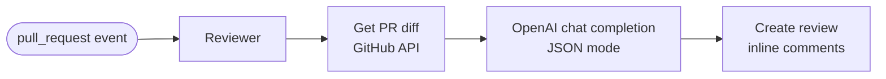

# AI PR Reviewer

A GitHub Action that sends a pull request's diff to OpenAI and posts the findings as inline review comments.

> **Status: early version (pre-release `v1.0.0`).** As committed, `action.yml` points to `dist/index.js`, but the
> build produces `dist/main.js`, so the action fails at start when used from a workflow. See
> [Known issues](#known-issues) before using it.

## What it does

On a `pull_request` event the action:

1. reads the PR number from the event,
2. fetches the PR's unified diff through the GitHub API,
3. sends the diff to OpenAI (default `gpt-4o`, JSON mode) with a prompt asking for bugs, security vulnerabilities
   and major code-style issues,
4. posts one review on the PR with an inline comment per finding, each prefixed with its severity
   (`[INFO]`, `[WARNING]`, `[CRITICAL]`).

It only comments. It never approves, requests changes, sets status checks or blocks a merge.

**Why:** a first pass on every PR catches cheap-to-fix problems early, before a human reviewer is free.

## Features

- Runs on every pull request with one workflow file
- Reviews the full diff with an OpenAI model of your choice (`model` input)
- Structured JSON output (`file`, `lineNumber`, `comment`, `severity`), so comments land on specific lines
- One review per run with a summary line ("AI Review completed. Found N potential issues.")
- Fails the step with a clear message if inputs or the API call fail

## Architecture


```mermaid
flowchart LR
    E([pull_request event]) --> R[Reviewer]
    R --> D[Get PR diff<br/>GitHub API]
    D --> O[OpenAI chat completion<br/>JSON mode]
    O --> P[Create review<br/>inline comments]
```

| File | Role |
|---|---|
| `src/main.ts` | Reads the action inputs and runs the reviewer |
| `src/reviewer.ts` | Orchestrates context → diff → analysis → review |
| `src/github.ts` | PR context, diff download, `pulls.createReview` |
| `src/openai.ts` | System prompt and the OpenAI call |
| `tests/reviewer.test.ts` | Jest tests with mocked GitHub and OpenAI clients |
| `action.yml` | Action metadata and inputs (node20) |

Design choices:

- **TypeScript on node20:** native to GitHub Actions, with `@actions/github` (Octokit) and the `openai` SDK.
- **Forced JSON:** the model must return file and line for every finding, so comments map to real lines.
- **Comment-only reviews:** the action never approves or blocks; people keep the merge decision.

## Usage

Once the entry point is fixed (see [Known issues](#known-issues)), add `.github/workflows/ai-review.yml` to the repo
you want reviewed:

```yaml
name: AI PR Reviewer
on: [pull_request]

permissions:
  contents: read
  pull-requests: write   # needed to post review comments

jobs:
  review:
    runs-on: ubuntu-latest
    steps:
      - name: Run AI Reviewer
        uses: avnishyadav25/gitHub-pr-reviewer-agent@<ref>   # a branch or tag with the fixed entry point
        with:
          openai_key: ${{ secrets.OPENAI_API_KEY }}
          github_token: ${{ secrets.GITHUB_TOKEN }}
          model: gpt-4o   # optional
```

Add `OPENAI_API_KEY` under **Settings → Secrets and variables → Actions**. `GITHUB_TOKEN` is provided by GitHub
Actions.

### Inputs

| Input | Description | Required | Default |
|---|---|---|---|
| `openai_key` | OpenAI API key (pass a secret) | Yes | — |
| `github_token` | Token used to read the diff and post the review | Yes | — |
| `model` | OpenAI model name | No | `gpt-4o` |
| `include_severity` | Comma-separated severities to post. **Read but not applied yet**: all severities are posted. | No | `info,warning,critical` |

### Example comment

What a comment looks like (the wording comes from the model and varies):

> **[WARNING]** You are concatenating user input into a SQL query, which allows SQL injection. Use a parameterised
> query instead.

## Development

```bash
npm install
npx tsc            # compiles src/ to dist/ (there is no npm build script yet)
npx jest           # runs the unit tests (there is no npm test script yet)
```

Notes:

- Delete the stale compiled files in `src/` (`src/*.js`, `src/*.d.ts` and their `.map` files) before running Jest;
  otherwise Jest loads them instead of the TypeScript sources and two tests fail.
- `tsc` warns (TS6059) that `tests/` is outside `rootDir: ./src`; the build still emits.
- `simulate.ts` only constructs the reviewer (the `start()` call is commented out) and needs `npm install dotenv`.
  To try it end to end, open a PR in a test repo instead.

## Known issues

- **Entry point:** `action.yml` has `main: dist/index.js`; the build outputs `dist/main.js`. Change `main` to
  `dist/main.js`, or bundle to `dist/index.js` (for example with `@vercel/ncc`).
- **Severity filter:** `include_severity` is not applied yet.
- **Large diffs:** the whole diff goes in one request; very large PRs can exceed the model's context window.
- **JSON shape:** JSON mode returns an object; the code unwraps a `reviews` key only. If the model uses another key,
  posting fails.
- **Comment lines:** if the model returns a line that isn't part of the diff, GitHub rejects the whole review.
- **Repo hygiene:** `node_modules/` and `dist/` are committed although `.gitignore` lists them.
- No CI workflow yet.

## Demo

- Demo video: _coming soon_ <!-- TODO: add the YouTube link -->
- Project write-up: _coming soon_ <!-- TODO: https://avnishyadav.com/projects/github-pr-reviewer once published -->

## License

No license file has been added yet (`package.json` says ISC). <!-- TODO (owner): add a LICENSE file and update this line. -->

## Author

Built by **Avnish Yadav**, AI automation engineer.

- Website: [avnishyadav.com](https://avnishyadav.com)
- YouTube: [@avnishcodes](https://www.youtube.com/@avnishcodes)
- LinkedIn: [avnishyadav25](https://in.linkedin.com/in/avnishyadav25)
- GitHub: [avnishyadav25](https://github.com/avnishyadav25)
